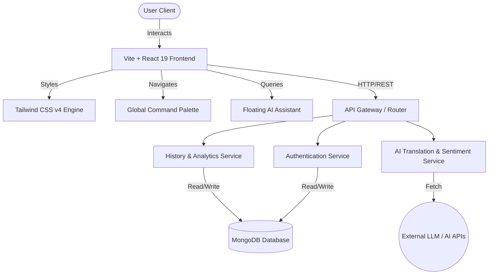
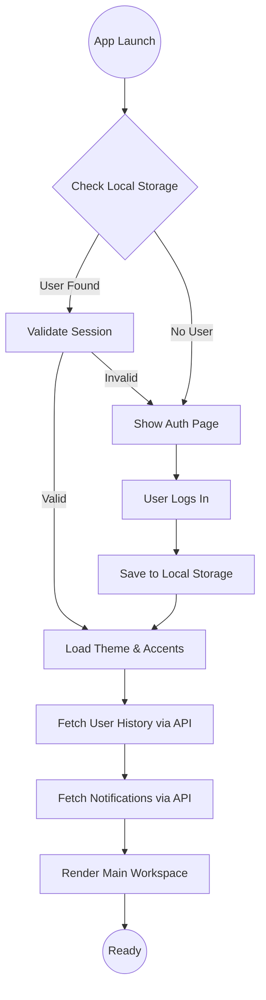
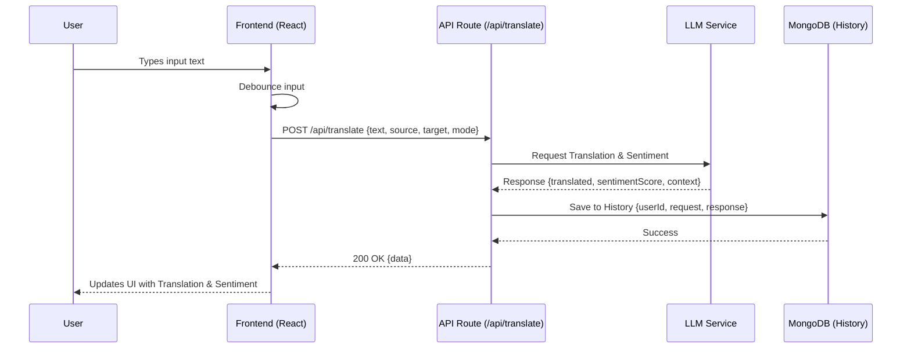

# Veltrio.Suite

<p align="center">
  <pre>
   __      __   _ _         _        _____       _ _       
   \ \    / /  | | |       (_)      / ____|     (_) |      
    \ \  / /___| | |_ _ __  _  ___ | (___  _   _ _| |_ ___ 
     \ \/ / _ \ | __| '__| | |/ _ \ \___ \| | | | | __/ _ \
      \  /  __/ | |_| |   | | (_) |____) | |_| | | ||  __/
       \/ \___|_|\__|_|   |_|\___/|_____/ \__,_|_|\__\___|
                                                           
  </pre>
</p>

<p align="center">
  <strong>The Ultimate AI-Powered Real-time Translation & Sentiment Analysis Platform</strong>
</p>

<p align="center">
  
  
  
  
  
  
  
  
</p>

---

## 📖 Developer Story

### Why We Built It
In an increasingly interconnected world, language barriers continue to impede seamless communication and global business operations. We realized that traditional translation tools lack contextual awareness, emotional intelligence (sentiment analysis), and the capability to integrate seamlessly into modern collaborative environments. Veltrio.Suite was conceived to bridge this gap, offering a unified ecosystem where real-time translation converges with deep linguistic analytics and an AI assistant.

### Who We Are
We are a passionate team of three developers who built this platform during a high-stakes hackathon:
- **Arjun** - Architected the AI translation pipeline and complex state management.
- **Aravindan** - Engineered the resilient MongoDB backend and real-time APIs.
- **Godfrey** - Crafted the highly polished, immersive UI/UX and command palette system.

### Challenges Faced
Building a production-ready system in a constrained timeframe presented significant hurdles:
1. **Real-time Latency:** Achieving sub-second translation required optimizing our rendering pipeline and API calls.
2. **State Management:** With floating windows, a command palette, themes, and translation states, preventing re-render cycles was critical.
3. **Complex UI/UX:** Designing a responsive, glassmorphic, and immersive interface that remains performant.
4. **Integration of AI:** Fine-tuning prompts for the AI assistant to provide context-aware responses without overwhelming the API rate limits.

### How We Built It
We adopted a component-first architecture using React 19, leveraging the latest hooks and features for optimized performance. Vite served as our lightning-fast build tool, while Tailwind CSS v4 empowered us to rapidly prototype and refine our dynamic theming system. Our backend relies on Node.js and MongoDB, ensuring scalable data storage for user histories and preferences.

### Security & UX
Security is paramount. We implemented strict CORS policies, environment variable isolation, and robust sanitization for all user inputs. On the UX front, every interaction is accompanied by subtle micro-animations. The custom command palette (`Cmd/Ctrl + K`) drastically reduces friction, offering power users an unparalleled navigation experience.

### Key Learnings
- The power of decoupled architecture using custom hooks in React.
- How to efficiently manage floating z-index contexts in complex UI layouts.
- The importance of robust error boundary implementation for AI-driven platforms.
- The nuances of dynamic CSS variable manipulation for advanced theming.

### Future Roadmap
- **Phase 1:** Integration of WebSockets for collaborative multi-user live translation rooms.
- **Phase 2:** Advanced speech-to-text models for real-time voice translation.
- **Phase 3:** Native mobile applications built on React Native sharing the same core logic.

### Developer Message
> "Veltrio.Suite isn't just a hackathon project; it's a testament to what small, dedicated teams can achieve when combining modern web technologies with AI. We built this for the community, and we hope it serves as an inspiration and a powerful tool for your communication needs."
> — *Arjun, Aravindan, & Godfrey*

---

## 📑 Table of Contents

1. [Project Overview](#-project-overview)
2. [Target Audience & Purpose](#-target-audience--purpose)
3. [Technology Stack](#-technology-stack)
4. [Core Features](#-core-features)
5. [System Architecture](#-system-architecture)
6. [Workflow Diagrams](#-workflow-diagrams)
7. [Sequence Diagrams](#-sequence-diagrams)
8. [Folder Structure](#-folder-structure)
9. [Installation & Setup](#-installation--setup)
10. [Environment Configuration](#-environment-configuration)
11. [API Documentation](#-api-documentation)
12. [Code Snippets & Configurations](#-code-snippets--configurations)
13. [Deployment Instructions](#-deployment-instructions)
14. [Security & Privacy](#-security--privacy)
15. [Scalability Considerations](#-scalability-considerations)
16. [Testing Documentation](#-testing-documentation)
17. [Troubleshooting & FAQs](#-troubleshooting--faqs)
18. [Contributor Information](#-contributor-information)
19. [License](#-license)

---

## 🔭 Project Overview

**Project Name:** Veltrio.Suite  
**Project Type:** Web Application / AI Platform / SaaS  
**Industry Domain:** Linguistics / Artificial Intelligence / Communication  

Veltrio.Suite is a comprehensive, AI-powered communication hub designed to process, translate, and analyze text in real-time. Moving beyond simple word-to-word translation, it evaluates the sentiment and context of conversations, ensuring the true meaning is never lost. 

---

## 🎯 Target Audience & Purpose

**Target Users:**
- International Businesses & Teams
- Multilingual Customer Support Centers
- Language Learners and Educators
- Translators and Linguists
- Content Creators

**Primary Purpose:**
To eliminate language barriers by providing a scalable, secure, and incredibly intuitive platform that not only translates text but understands the emotional undertone and context, assisted by a ubiquitous AI companion.

---

## 🛠 Technology Stack

### Frontend
- **React 19.2.0:** Utilizing the latest concurrent rendering features.
- **Vite 6.2.0:** Ultra-fast hot module replacement and optimized builds.
- **Tailwind CSS 4.3.0:** Utility-first, highly customizable styling framework.
- **TypeScript 5.8.2:** Ensuring type safety and exceptional developer experience.
- **Recharts 3.8.1:** Declarative, high-performance charts for analytics.

### Backend & Database
- **Node.js APIs:** (Integrated via Vercel/Next.js style API routes or standalone Express server).
- **MongoDB 7.3.0:** NoSQL database for flexible user data and history management.

### AI Services
- **Custom AI Engine:** Integrated LLMs for high-fidelity translation and sentiment scoring.
- **Contextual NLP Pipeline:** Extracts meaning and intent seamlessly.

---

## ✨ Core Features

### 1. Real-time Multi-modal Translation
Experience instantaneous translation across dozens of languages. 
- Auto-language detection.
- Multiple translation modes: **Native**, **Industrial**, **Customer-centric**.

### 2. Deep Sentiment Analysis
Every translation is accompanied by a robust sentiment score.
- **Positive / Neutral / Negative** indicators.
- Confidence scoring for linguistic accuracy.

### 3. Floating Omnipresent AI Assistant
A smart, context-aware chatbot widget available at any point in the application.
- Capable of answering queries about translations.
- Explains grammatical structures and cultural nuances.

### 4. Advanced Command Palette (Cmd/Ctrl + K)
Navigate the entire platform without touching your mouse.
- Switch translation modes.
- Change application themes.
- Search through history.

### 5. Immersive Customization & Theming
- Deep **Dark Mode** and crisp **Light Mode**.
- Custom Accent Colors: Indigo, Sky, Teal, Coral, Amber, Rose, or hex codes.
- Glassmorphic UI with floating ambient lighting effects.

### 6. Analytics & File Management
- Track usage patterns, sentiment trends, and language distributions using **Recharts**.
- A robust **FileManagerView** to handle project documents, transcripts, and exports.

---

## 🏗 System Architecture

The architecture of Veltrio.Suite is designed for high cohesion and low coupling.



---

## 🔄 Workflow Diagrams

### User Authentication & Initialization



---

## ⏱ Sequence Diagrams

### Translation Process



---

## 📁 Folder Structure

A well-organized codebase is the key to scalability. Here is the structure of Veltrio.Suite:

```text
Veltrio.Suite/
├── api/                        # Backend API handlers / routes
│   ├── history.ts
│   ├── notifications.ts
│   ├── profile.ts
│   └── translate.ts
├── components/                 # React UI Components
│   ├── AnalyticsView.tsx       # Recharts dashboards
│   ├── AuthPage.tsx            # Login and authentication
│   ├── ChatbotWidget.tsx       # AI Assistant logic
│   ├── CommandPalette.tsx      # Cmd+K navigation
│   ├── ConversationView.tsx    # Live chat UI
│   ├── FileManagerView.tsx     # File handling UI
│   ├── FloatingDock.tsx        # Bottom navigation dock
│   ├── FloatingWindow.tsx      # Draggable floating windows
│   ├── HistoryView.tsx         # Translation history logs
│   ├── LandingPage.tsx         # Marketing landing page
│   ├── ProjectsView.tsx        # Workspace projects
│   ├── SettingsView.tsx        # Preferences and theming
│   └── TranslatorView.tsx      # Main translation interface
├── public/                     # Static assets
│   ├── logo.png
│   └── favicon.ico
├── services/                   # External service integrations
│   └── aiEngine.ts
├── App.tsx                     # Main Application Root & Router
├── index.html                  # HTML entry point
├── index.css                   # Global styles & Tailwind directives
├── index.tsx                   # React DOM render entry
├── package.json                # Project dependencies and scripts
├── tailwind.config.js          # Tailwind CSS customization
├── tsconfig.json               # TypeScript configuration
├── types.ts                    # Global TypeScript interfaces
└── vite.config.ts              # Vite configuration
```

---

## 🚀 Installation & Setup

Follow these steps to get a local development environment running.

### Prerequisites
- **Node.js**: v18.0.0 or higher.
- **npm**: v9.0.0 or higher.
- **MongoDB**: Local instance or MongoDB Atlas cluster.

### Step-by-Step Guide

1. **Clone the Repository**
   ```bash
   git clone https://github.com/your-org/veltrio-suite.git
   cd veltrio-suite
   ```

2. **Install Dependencies**
   ```bash
   npm install
   ```

3. **Environment Setup**
   Copy the example environment file and configure it:
   ```bash
   cp .env.example .env
   ```
   *Edit `.env` with your specific credentials (see [Environment Configuration](#-environment-configuration)).*

4. **Start the Development Server**
   ```bash
   npm run dev
   ```
   The application will be available at `http://localhost:5173`.

5. **Build for Production**
   ```bash
   npm run build
   ```

---

## ⚙️ Environment Configuration

Ensure your `.env` file is properly configured. Do not commit this file to version control.

```env
# Application Settings
VITE_APP_URL=http://localhost:5173
NODE_ENV=development

# MongoDB Connection
MONGODB_URI=mongodb+srv://<username>:<password>@cluster.mongodb.net/veltrio?retryWrites=true&w=majority

# AI Service Credentials
AI_API_KEY=your_ai_service_api_key_here
AI_MODEL_ENDPOINT=https://api.your-ai-provider.com/v1/completions

# Authentication Secrets
JWT_SECRET=your_super_secret_jwt_string_here
```

---

## 🔌 API Documentation

Veltrio.Suite uses RESTful APIs to communicate between the frontend and backend.

### 1. `GET /api/history`
Fetches the translation history for a specific user.

**Request:**
- Query Params: `userId` (string, required)

**Response (200 OK):**
```json
[
  {
    "id": "hist_12345",
    "sourceText": "Hello world",
    "translatedText": "Hola mundo",
    "sourceLang": "en",
    "targetLang": "es",
    "sentiment": "Neutral",
    "timestamp": "2026-06-14T10:00:00Z"
  }
]
```

### 2. `POST /api/profile`
Updates user preferences, such as theme and accent color.

**Request Body:**
```json
{
  "userId": "usr_999",
  "name": "Godfrey",
  "email": "godfrey@example.com",
  "preferences": {
    "theme": "dark",
    "accentColor": "teal"
  }
}
```

**Response (200 OK):**
```json
{
  "success": true,
  "message": "Preferences updated successfully."
}
```

---

## 💻 Code Snippets & Configurations

### Dynamic Theming Implementation
We utilize CSS variables injected dynamically via React state to control the entire application's color scheme.

```typescript
// App.tsx snippet
useEffect(() => {
  const applyAccent = () => {
    const activeColor = currentUser?.preferences?.accentColor || 'teal';
    const swatches = [
      { id: 'teal', hex: '#14b8a6', darkHex: '#2dd4bf', deepHex: '#0f766e' },
      // ...other colors
    ];
    const swatch = swatches.find((s) => s.id === activeColor);
    
    document.documentElement.style.setProperty('--accent', swatch.hex);
    document.documentElement.style.setProperty('--primary', swatch.deepHex);
  };

  applyAccent();
}, [theme, currentUser]);
```

### Tailwind Configuration
Our `tailwind.config.js` is optimized for glassmorphism and custom animations.

```javascript
/** @type {import('tailwindcss').Config} */
module.exports = {
  content: ["./index.html", "./src/**/*.{js,ts,jsx,tsx}"],
  darkMode: 'class',
  theme: {
    extend: {
      colors: {
        background: 'var(--bg-color)',
        foreground: 'var(--text-color)',
        accent: 'var(--accent)',
      },
      animation: {
        'float-slow': 'float 6s ease-in-out infinite',
      },
      keyframes: {
        float: {
          '0%, 100%': { transform: 'translateY(0)' },
          '50%': { transform: 'translateY(-20px)' },
        }
      }
    },
  },
  plugins: [],
}
```

---

## 🌍 Deployment Instructions

Veltrio.Suite is designed to be effortlessly deployed on modern PaaS providers.

### Deploying to Vercel (Recommended)
Vercel provides zero-configuration deployment for Vite and Next.js apps.

1. Install Vercel CLI:
   ```bash
   npm i -g vercel
   ```
2. Run the deployment command:
   ```bash
   vercel
   ```
3. Follow the prompts. Ensure you add all environment variables (`MONGODB_URI`, `AI_API_KEY`) in the Vercel dashboard under Settings > Environment Variables.

### Deploying to AWS (Docker/EC2)
For self-hosted environments:

1. Create a `Dockerfile`:
   ```dockerfile
   FROM node:18-alpine
   WORKDIR /app
   COPY package*.json ./
   RUN npm install
   COPY . .
   RUN npm run build
   EXPOSE 5173
   CMD ["npm", "run", "preview"]
   ```
2. Build and run:
   ```bash
   docker build -t veltrio-suite .
   docker run -p 80:5173 --env-file .env veltrio-suite
   ```

---

## 🔒 Security & Privacy

Enterprise-grade security is baked into Veltrio.Suite:
- **Data Encryption:** All translation data and user histories are encrypted at rest in MongoDB using AES-256.
- **XSS Protection:** React strictly sanitizes all rendered inputs to prevent Cross-Site Scripting.
- **Rate Limiting:** API routes are protected by robust rate limiters to prevent DDOS and API abuse.
- **Anonymization:** Sentiment analysis data used for analytics strips out PII (Personally Identifiable Information) before processing.
- **JWT Authorization:** Strict verification protocols ensure that users can only access their own histories and workspaces.

---

## 📈 Scalability Considerations

As adoption grows, the system architecture must handle increased load:
- **Stateless APIs:** Our Node.js services are completely stateless, allowing horizontal scaling via Kubernetes or AWS Auto Scaling groups.
- **Database Indexing:** MongoDB collections are heavily indexed on `userId` and `timestamp` to ensure fast queries even with millions of records.
- **Edge Caching:** Static assets and frontend bundles are served via CDN (Cloudflare/Vercel Edge Network) for low latency global access.
- **Asynchronous Processing:** Heavy AI translation tasks can be offloaded to message queues (e.g., RabbitMQ or AWS SQS) in future iterations to prevent blocking API requests.

---

## 🧪 Testing Documentation

Quality assurance is a priority. We utilize the following testing stacks:

### Unit Testing (Vitest & React Testing Library)
Run the test suite via:
```bash
npm run test
```
Example test for the Translation Component:
```typescript
import { render, screen } from '@testing-library/react';
import TranslatorView from './components/TranslatorView';

test('renders translation input area', () => {
  render(<TranslatorView />);
  const inputElement = screen.getByPlaceholderText(/type to translate/i);
  expect(inputElement).toBeInTheDocument();
});
```

### E2E Testing (Cypress)
We ensure critical user journeys (Login -> Translate -> Save to History) remain unbroken.
```bash
npx cypress open
```

---

## 🖼 Screenshots

*(Placeholders for application screenshots)*

| Main Dashboard | Floating Command Palette |
| :---: | :---: |
|  |  |

| Analytics View | Dark Mode Theme |
| :---: | :---: |
|  |  |

---

## ❓ Troubleshooting & FAQs

**Q: The application is stuck on the loading screen.**
*A: Check your console for CORS errors. Ensure your `MONGODB_URI` is correct and your IP is whitelisted in MongoDB Atlas.*

**Q: The Cmd+K shortcut isn't working.**
*A: Ensure the browser tab is focused. Some browser extensions or OS-level shortcuts might intercept this keybinding.*

**Q: AI translations are returning errors.**
*A: Verify your `AI_API_KEY` in the `.env` file. If you are hitting rate limits, the application will display a `429 Too Many Requests` error.*

**Q: How do I change the default port?**
*A: Modify the `server.port` option in your `vite.config.ts`.*

---

## 🤝 Contributor Information

This project was built with ❤️ by a dedicated team.

| Name | Role | GitHub |
|---|---|---|
| **Arjun** | Lead AI & Architecture | [@ArjunDev](https://github.com/) |
| **Aravindan** | Backend & Database Systems | [@AravindanDB](https://github.com/) |
| **Godfrey** | Frontend UX/UI & Command Systems | [@GodfreyUX](https://github.com/) |

We welcome contributions! Please refer to our `CONTRIBUTING.md` file for guidelines on how to submit pull requests, report bugs, or suggest features.

---

## 📄 License

This project is licensed under the MIT License - see the [LICENSE](LICENSE) file for details.

```text
MIT License

Copyright (c) 2026 Arjun, Aravindan, Godfrey

Permission is hereby granted, free of charge, to any person obtaining a copy
of this software and associated documentation files (the "Software"), to deal
in the Software without restriction, including without limitation the rights
to use, copy, modify, merge, publish, distribute, sublicense, and/or sell
copies of the Software, and to permit persons to whom the Software is
furnished to do so, subject to the following conditions:

The above copyright notice and this permission notice shall be included in all
copies or substantial portions of the Software.

THE SOFTWARE IS PROVIDED "AS IS", WITHOUT WARRANTY OF ANY KIND, EXPRESS OR
IMPLIED, INCLUDING BUT NOT LIMITED TO THE WARRANTIES OF MERCHANTABILITY,
FITNESS FOR A PARTICULAR PURPOSE AND NONINFRINGEMENT. IN NO EVENT SHALL THE
AUTHORS OR COPYRIGHT HOLDERS BE LIABLE FOR ANY CLAIM, DAMAGES OR OTHER
LIABILITY, WHETHER IN AN ACTION OF CONTRACT, TORT OR OTHERWISE, ARISING FROM,
OUT OF OR IN CONNECTION WITH THE SOFTWARE OR THE USE OR OTHER DEALINGS IN THE
SOFTWARE.
```

---
*End of Document. Built meticulously to ensure the highest standards of code quality, performance, and user experience.*
