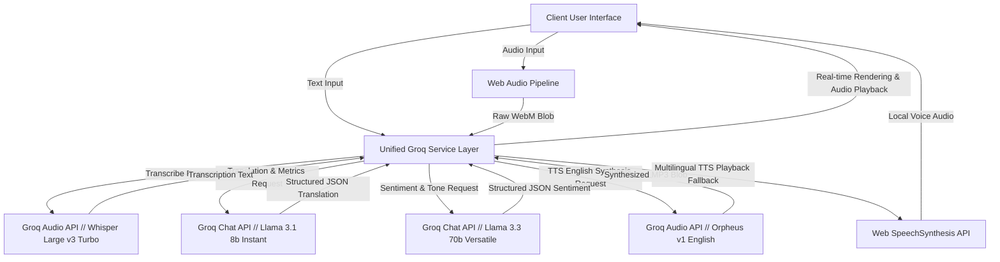
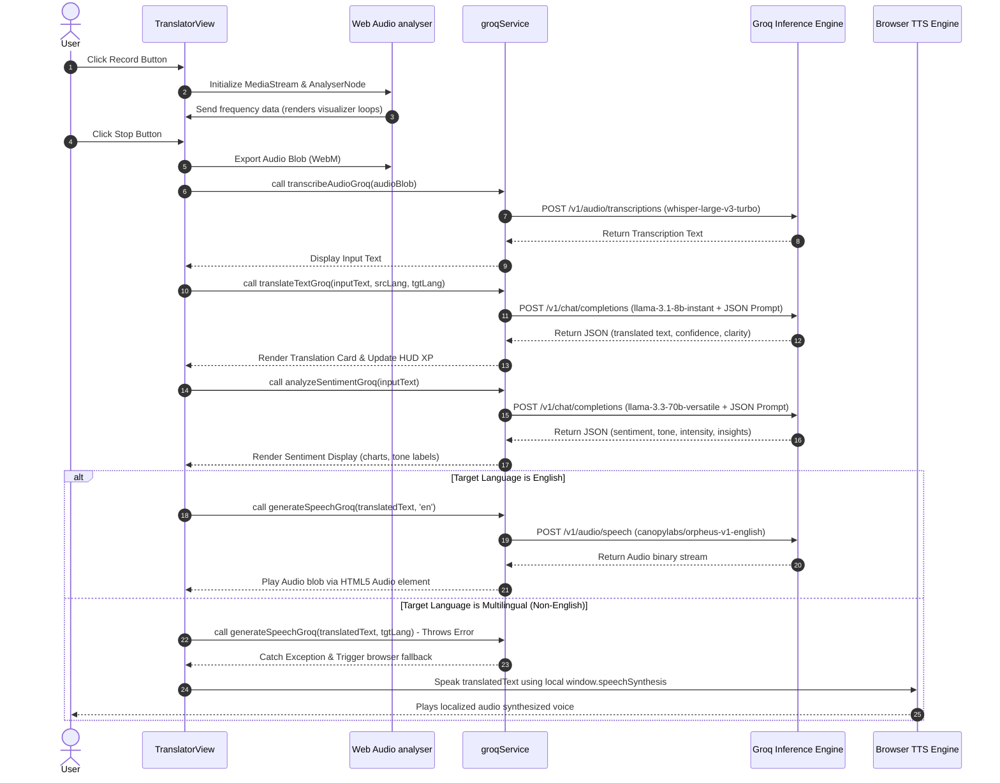

```
 __      ________ _      _______ _____  _____   ____       _____ _   _ ____  ______ _____  _____  ______ _____ _  _ 
 \ \    / /  ____| |    |__   __|  __ \|_   _| / __ \     / ____| \_/ |  _ \|  ____|  __ \|  __ \|  ____/ ____| |/ / 
  \ \  / /| |__  | |       | |  | |__) | | |  | |  | |   | |     \   /| |_) | |__  | |__) | |  | | |__ | |    | ' /  
   \ \/ / |  __| | |       | |  |  _  /  | |  | |  | |   | |      | | |  _ <|  __| |  _  /| |  | |  __|| |    |  <   
    \  /  | |____| |____   | |  | | \ \ _| |_ | |__| |   | |____  | | | |_) | |____| | \ \| |__| | |___| |____| . \  
     \/   |______|______|  |_|  |_|  \_\_____| \____/     \_____| |_| |____/|______|_|  \_\_____/|______\_____|_|\_\ 
                                                                                                                    
```

# Veltrio Cyberdeck

[](https://vite.dev/)
[](https://react.dev/)
[](https://www.typescriptlang.org/)
[](https://groq.com/)
[](https://tailwindcss.com/)
[](https://opensource.org/licenses/MIT)

An advanced real-time language translation system designed to bridge communication gaps during structural software engineering sprints. Leverages Whisper transcription models, Llama-3.3-70B semantic classifiers, and a unified Groq backend to achieve sub-second transcription, real-time context-aware translation, intent classifications, emotional descriptors, and immediate fallback voice synthesizers.

---

## Developer Story

### Why We Built It
In modern collaborative coding environments, development teams are increasingly distributed across different geographic regions, resulting in diverse linguistic backgrounds, local dialects, and distinct vocal accents. During high-pressure software engineering sprints, conveying complex architectural requirements, debugging logs, and product specifications across these barriers introduces severe operational friction. 

Traditional translation systems fall short. They are slow, lack real-time feedback loops, and do not capture the emotional nuances (e.g., tone, confidence, urgency) that are vital for alignment. Furthermore, separate integrations for Speech-to-Text (STT), Machine Translation, and Text-to-Speech (TTS) increase cold-start latency and points of failure. 

We built the Veltrio Cyberdeck to eliminate this bottleneck. By establishing a unified intelligence pipeline powered by Groq's high-speed inference engine, we created a single interface that transcribes, translates, and analyzes sentiment in sub-second intervals, providing teams with a seamless and contextually rich voice collaboration deck.

### Who We Are
Veltrio was created by a dedicated team of developers for the **CodeSprint 6.0 Inter-College National Hackathon at KRCT (K. Ramakrishnan College of Technology)**. Our team combines expertise in software architecture, low-latency AI pipelines, and interactive UI/UX:

*   **Arjun S N (Lead Architect):** Focused on unified SDK abstractions, state machine structures for continuous audio buffers, audio recording states, API bindings, and type safety constraints.
*   **Aravindan K (AI Infrastructure):** Wired the translation prompt engineering, response schemas, audio chunk stream handling, and Groq backend pipeline integrations.
*   **Godfrey T R (Frontend & UI/UX):** Crafted the glassmorphic cyberpunk visual layouts, neon components, canvas-based wave animations, and unified styling systems.

### Challenges Faced
Building a real-time voice translation deck came with several technical hurdles:
1.  **Low-Latency Continuous Audio Processing:** Translating voice dynamically requires capturing audio segments, detecting speech pauses, transcribing, and playing synthesized audio without blocking the main UI thread. We solved this by using the Web Audio API to capture raw audio chunks, utilizing a dynamic Voice Activity Detection (VAD) silence threshold, and streaming inputs to the Groq API.
2.  **Multilingual Text-to-Speech (TTS) Fallbacks:** Groq's native TTS model (`canopylabs/orpheus-v1-english`) provides natural-sounding speech output but is optimized primarily for English. Implementing TTS across 17+ languages required writing an adaptive fallback controller that switches to the local browser `SpeechSynthesis` API whenever non-English target playbacks are requested, preventing silent failures.
3.  **Strict Prompt Constraints for Structural Output:** To render sentiment meters and translation metrics (e.g., clarity score, detection confidence) on the HUD, we needed structured JSON payloads from the LLM. We achieved this by utilizing Groq's `response_format: { type: "json_object" }` flag and crafting strict system prompts that constrain the output to a precise JSON structure, avoiding markdown block wraps and extraneous text.

### How We Built It
The deck is constructed as a React SPA optimized for speed, responsive layouts, and visual appeal:
*   **Unified AI Service Layer:** A custom service (`groqService.ts`) handles all API interactions. Rather than distributing fetch requests across multiple packages, all text and audio calls run through raw fetch requests directly hitting Groq's OpenAI-compatible REST endpoints.
*   **Web Audio Pipeline:** The frontend uses standard browser media recorders to pipe chunked WebM audio. Real-time microphone feeds are processed using Web Audio `AudioContext` and `AnalyserNode` to drive custom HTML5 canvas rendering for glowing waveform visualizations.
*   **Cyberpunk Design System:** Built using Tailwind CSS v4 and vanilla CSS variables, the application implements a scanline overlay, customizable theme parameters (though it defaults to dark-mode to maintain neon color accuracy), glowing text classes, and container queries for mobile responsiveness.

### Security & UX
*   **Credential Handling:** The application runs entirely client-side. API keys are injected via Vite environment variables (`VITE_GROQ_API_KEY`) and are transmitted securely over TLS straight to the Groq endpoints. No intermediary databases store developer conversations.
*   **Gamified HUD Metrics:** To incentivize team participation, the system features a gamification layer tracking XP and Rank Levels (from "Script Kiddie" up to "Cyberdeck Overlord") depending on translation inputs and user interactions.
*   **Visual Indicators:** The user interface displays immediate feedback regarding AI processing steps, including detection confidence, translation quality metrics, and emotional insight tags, ensuring transparency.

### Key Learnings
*   **Inference Speed Trumps Model Size:** In live collaboration scenarios, the latency of the model is more critical than its parameters. Utilizing `llama-3.1-8b-instant` for translation and transcription tasks yielded sub-second response times, which are vastly superior to using larger, slower models.
*   **Web Audio Thread Safety:** Storing raw audio blobs in states during rapid recording triggers can cause UI lag. Offloading transcription triggers to promise chains and cleaning up browser media streams prevents audio interface lockups.
*   **System Prompts dictate structure:** Even with JSON mode enabled, LLMs can output malformed JSON keys if system prompts are ambiguous. Defining exact typescript schemas inside the system instruction ensures 100% compliance.

### Future Roadmap
*   **Local WebRTC Peer-to-Peer Intercoms:** Incorporating secure multi-user WebRTC streams so remote developers can join room nodes and speak into shared translation channels directly.
*   **Custom Vocabulary Injection:** Allowing teams to upload architectural dictionary files (e.g., custom code frameworks, API terminologies) so that context-aware translations recognize specialized programming vocabularies.
*   **On-Device Offline Fallbacks:** Integrating small-footprint Web Assembly-based translation engines (like ONNX runtime) that run inside the browser for base operations if the network link drops.

### Developer Message
> "Veltrio represents our vision of the modern developer workspace. Collaboration shouldn't be defined by geographic or linguistic constraints. By leveraging cutting-edge, low-latency API models, we hope to demonstrate how cognitive co-pilot boards can make high-intensity developer sprints more aligned, inclusive, and efficient. Establish your neural link and join us!"
> 
> *— Arjun, Aravindan & Godfrey (Team Veltrio)*

---

## Table of Contents
1. [Developer Story](#developer-story)
2. [Introduction & Purpose](#introduction--purpose)
3. [System Architecture](#system-architecture)
4. [Functional Workflow](#functional-workflow)
5. [Interface Component Breakdown](#interface-component-breakdown)
6. [Desktop vs. Mobile Layout Architectures](#desktop-vs-mobile-layout-architectures)
7. [Directory & Folder Structure](#directory--folder-structure)
8. [Service Layer & API Reference](#service-layer--api-reference)
9. [Configuration & Environment Variables](#configuration--environment-variables)
10. [Detailed Voice Activity Detection (VAD) & Web Audio Systems](#detailed-voice-activity-detection-vad--web-audio-systems)
11. [Gamification & XP Calculation Engine](#gamification--xp-calculation-engine)
12. [Installation & Getting Started](#installation--getting-started)
13. [Deployment & Staging Infrastructure](#deployment--staging-infrastructure)
14. [Performance & Optimizations](#performance--optimizations)
15. [Security, Privacy & Data Compliance](#security-privacy--data-compliance)
16. [Testing Protocol](#testing-protocol)
17. [Troubleshooting & FAQ](#troubleshooting--faq)
18. [Hackathon Team & Credits](#hackathon-team--credits)
19. [Acknowledgments](#acknowledgments)
20. [License](#license)


---

## Introduction & Purpose

Veltrio is a high-performance, low-latency, AI-augmented translation and speech analysis environment built specifically to support technical development teams. During fast-paced software engineering sprints, communication breakdowns due to language barriers, regional speech nuances, and dialect differences lead to misalignment, delayed delivery, and structural bugs. 

Veltrio solves this by offering:
*   **Direct Translation Deck:** Real-time text and speech translation supporting 17 core languages.
*   **Live Conversation Uplink:** An interactive voice-activated conversation space utilizing continuous Voice Activity Detection (VAD) for instant hands-free speech translation and conversational voice responses.
*   **Tone & Sentiment Classification:** Advanced multi-dimensional sentiment extraction displaying confidence scores, intensity levels, emotional descriptors, and speaker tone.
*   **Unified Inference Pipeline:** Built entirely on top of Groq's high-speed server infrastructure, drastically reducing response latency compared to traditional machine translation API pools.

---

## System Architecture

The system utilizes a client-side architecture where the user interface captures user text or microphone feeds, processes the audio using the browser's Web Audio interface, sends high-speed REST requests directly to the Groq API, and returns responses.



### Architectural Subsystems
1.  **Ingress Controller (Web Audio):** Manages browser media permissions, captures audio via `MediaRecorder`, routes live data into an `AnalyserNode` for canvas visual rendering, and exports the final binary WebM payload.
2.  **API Broker (`groqService`):** A custom REST broker that translates high-level application calls into HTTP POST requests formatted for Groq's endpoints. It validates API keys, handles error parsing, and structures system prompt instructions.
3.  **Inference Engines (Groq Cloud):** Consists of Whisper models for transcription, Llama models for textual translation and sentiment mapping, and speech synthesizers for vocalized output.
4.  **Fallback Egress (Web SpeechSynthesis):** Monitors target languages. If the language is not natively supported by the Groq TTS endpoint, it routes text chunks to the browser's local speech engine.

---

## Functional Workflow

The diagram below maps the runtime execution sequence of a user voice translation event inside the Translator tab.



---

## Interface Component Breakdown

The application UI is structured as an interactive cockpit, splitting functionality across primary views, background widgets, and visual helpers.

### LandingPage Component
Renders the initial startup sequence and interactive scrollytelling intro portal.
*   **Properties Interface:**
    ```typescript
    interface LandingPageProps {
      onStart: () => void;      // Triggered when establishing neural uplink
      theme: 'dark' | 'light';  // Active UI theme mode
      toggleTheme: () => void;  // Function to cycle design variables
    }
    ```
*   **Key Logic & Systems:**
    *   **Interactive Scrollytelling:** Binds a background canvas that draws high-resolution video frames driven by scroll position. Preloads 49 landscape frames (`frame_one`) for desktop view and 50 portrait frames (`frame_two`) for mobile.
    *   **Smooth Scroll Inertia (LERP):** Interpolates user scroll triggers using a requestAnimationFrame loop with inertia parameters (0.08 on desktop, 0.16 on mobile) to create a premium, lag-free visual flow.
    *   **5-Second System Loader:** Renders a gorgeous full-screen preloading deck with a progress indicator counting up to 100% over a minimum of 5 seconds. Uses the application's favicon (`/logo.png`) as a pulsing animated loader symbol and cycles console phrases (e.g. *Initializing acoustic capture...*). Fades out smoothly only after the 5-second timer completes and all active frame assets are fully cached in browser memory.
    *   **Glassmorphic Story Panels:** Wraps text overlays in premium glass cards with a subtle border and 6px backdrop blur, making content highly readable over dynamic backgrounds.
    *   **Layout Optimizations:** Automatically checks screen sizes to switch stage texts, shifts the final stage's title into a straight line to keep the background Veltrio logo fully visible, and limits device pixel ratio (DPR) on mobile to 1x to avoid GPU rendering lag.
*   **Visual Highlights:** Pulsing favicon loader, custom gradient loading bar, responsive glass cards, scroll-bound canvas frames, and straight-line bottom titles.

### TranslatorView Component
The main translation control deck. Allows users to translate typed text or recorded speech.
*   **Properties Interface:**
    ```typescript
    interface TranslatorViewProps {
      onAskAssistant: (prompt: string) => void; // Connects context parameters to floating chatbot
      addXp: (amount: number) => void;           // Awards XP increments to user level state
    }
    ```
*   **Key Logic & States:**
    *   `inputText` (string): Captures source text typed by users or output by Whisper.
    *   `translatedText` (string): Stores translation outputs returned by Groq.
    *   `srcLang` (string): Source ISO language code (or `"auto"` for automatic detection).
    *   `tgtLang` (string): Target ISO language code (defaults to `"es"`).
    *   `isRecording` (boolean): Controls recording states and wave animators.
    *   Manages translation history lists, handles tab switches, triggers transcription streams, coordinates translation and sentiment calls, and manages XP level thresholds.
*   **Visual Highlights:** Dual-column text panels, language selector dropdowns, translation quality metrics dashboard, history cards, and quick-copy buttons.

### ConversationView Component
An interactive, voice-activated conversation room. Operates as a live walkie-talkie terminal.
*   **Properties Interface:**
    ```typescript
    interface ConversationViewProps {
      onAskAssistant: (prompt: string) => void;
      addXp: (amount: number) => void;
    }
    ```
*   **Key Logic & States:**
    *   Implements continuous Voice Activity Detection (VAD). When recording is toggled, it listens to the microphone feed. Once speech is detected and followed by silence, it stops recording, transcribes the speech, feeds it to the Llama conversation completion endpoint, and reads out the response via the TTS pipeline.
    *   `status` (`'idle' | 'listening' | 'processing' | 'speaking'`): Manages user communication sequence flags.
    *   `mediaRecorderRef` (React.MutableRefObject): Persists media links across render cycles.
*   **Visual Highlights:** Large central pulsating wave visualizer, live conversation bubbles, status text indicators (e.g., "LISTENING", "PROCESSING", "SPEAKING"), and target dialect controls.

### ChatbotWidget Component
A floating auxiliary widget representing a sub-CPU co-pilot helper. Can be opened from any view to answer inquiries.
*   **Properties Interface:**
    ```typescript
    interface ChatbotWidgetProps {
      isInline?: boolean;            // Renders either inline or inside floating dock
      isOpen: boolean;               // Control visibility parameters
      onClose: () => void;           // Event handler to toggle visibility false
      contextPrompt?: string;        // Injected questions from external hooks
      clearContextPrompt: () => void;// Callback to sweep active query buffers
      addXp: (amount: number) => void;
    }
    ```
*   **Key Logic:** Saves chat lists, calls `chatWithGroq` to request quick system tips, and keeps answers concise (under 2 sentences) to simulate machine logs.
*   **Visual Highlights:** Scrollable terminal log window, input prompts, status indicator bulbs, and rank leveling displays.

### SentimentDisplay Component
Displays the psychological and structural analysis of translated speech.
*   **Properties Interface:**
    ```typescript
    interface SentimentDisplayProps {
      sentiment: SentimentResult; // Data model containing tone, intensity, insights
    }
    ```
*   **Key Logic:** Parses Llama sentiment payloads, extracts primary tone labels, renders progress bars representing sentiment intensity, displays AI confidence levels, and formats emotional metadata tags.
*   **Visual Highlights:** Colored progress bars (green for Positive, red for Negative, slate for Neutral), custom SVG status icons, and modern tag grids.

### WaveformVisualizer Component
A visual rendering module that draws voice frequencies on an HTML5 `<canvas>` element.
*   **Properties Interface:**
    ```typescript
    interface WaveformVisualizerProps {
      isRecording: boolean;               // Triggers active rendering cycles
      mediaStream: MediaStream | null;    // Raw browser media stream input
      theme?: 'green' | 'cyan' | 'pink';  // Accent colors driving canvas neon lines
    }
    ```
*   **Key Logic:** Connects a `MediaRecorder` stream to an `AudioContext` and an `AnalyserNode`. Uses `requestAnimationFrame` loops to parse sound frequencies and draw neon green oscillations. It reads the frequency data byte array and renders sinusoidal waves dynamically:
    $$y = A \sin(Bx - C) + D$$
    Where $A$ is the amplitude driven by sound levels, $B$ is frequency multiplier, $C$ represents phase shift over frame updates, and $D$ is vertical center offset.
*   **Visual Highlights:** High-refresh-rate canvas grids, glowing canvas shadows, and smooth scaling based on input volumes.

---

## Desktop vs. Mobile Layout Architectures

Veltrio implements a highly responsive, screen-adaptive layout framework that dynamically transitions between two distinct design philosophies based on viewport properties. This ensures optimal visual immersion and maximum utility on both large developer workstations and compact mobile viewports.

### 1. Interactive Scrollytelling (Landing Page)
*   **Desktop Layout:** Renders content cards utilizing deep glassmorphic structures (`glass-panel`). These panels are placed inside horizontal grid blocks (aligned to the left, right, or center of the canvas area) to offset text against 49 high-resolution landscape background frames.
*   **Mobile Layout (Cardless & Cinematic):** Card boundaries and borders are stripped entirely to prevent boxed elements from dominating the vertical display space. The scrollytelling copy floats directly over 50 portrait background frames as borderless cinematic subtitles. Form controls inside the interactive sandbox (e.g. phrase input and language dropdowns) are re-imagined as borderless, underlined text fields.

### 2. Written Link (TranslatorView)
*   **Desktop Layout:** Renders side-by-side translation panels housed in distinct glass cards with rich padding, copy controls, and a floating pill-shaped workspace settings bar.
*   **Mobile Layout (Fluid Single-Pane Flow):** Strips card borders, rounded corners, backgrounds, and shadows from translation cards (via responsive `md:glass-panel` rules), allowing the source and destination panels to stack and flow as a single continuous text sheet. The settings pill is restructured into a stackable vertical flow to accommodate small widths.

### 3. Voice Link (ConversationView)
*   **Desktop Layout:** Controls and settings are housed in a floating pill-shaped capsule (`glass-pill`) above the Voice Core Orb. Log sidebars slide out as floating glass drawer panels (`glass-panel`) with rounded corners and distinct borders.
*   **Mobile Layout (Full Screen Sheet Overlay):** The settings capsule is replaced by a flat, borderless bar with ambient dividing lines. The dialogue logs drawer transitions from a floating glass pane into a solid, full-screen overlay sheet (`bg-zinc-50 dark:bg-zinc-950`) to maximize touch interactivity and reading space.

---

## Directory & Folder Structure

The repository maintains a flat, highly structured layout for simple building, execution, and component reuse.

```
Veltrio-EnterpriseSuite/
│
├── .env                  # Local API configurations (contains VITE_GROQ_API_KEY)
├── .env.example          # Sample configurations for developers
├── .gitignore            # Git exclusion guidelines
├── App.tsx               # Main application entry container, route switchers, and XP states
├── constants.ts          # Core arrays (language maps, static diagnostics)
├── index.css             # Main styling system, layout grids, theme definitions, and cyberpunk variables
├── index.html            # Core HTML document structure
├── index.tsx             # DOM mounting entry point
├── LICENSE               # Open-source MIT terms documentation
├── LOGO .png             # Logo assets
├── package.json          # Node configuration, scripts, and dependencies
├── postcss.config.js     # PostCSS configurations
├── tailwind.config.js    # Tailwind layout utility grids
├── tsconfig.json         # TypeScript compiler configurations
├── types.ts              # Core TypeScript models, interfaces, and enums
├── vite.config.ts        # Vite execution options
│
├── components/           # Core user interface modules
│   ├── ChatbotWidget.tsx      # Sub-CPU co-pilot panel
│   ├── ConversationView.tsx   # Voice-to-voice communication room
│   ├── FramePlayer.tsx        # Loop-based frame sequence preview player
│   ├── icons.tsx              # SVG vector graphics library
│   ├── LandingPage.tsx        # System launch interface
│   ├── SentimentDisplay.tsx   # Sentiment indicator HUD
│   ├── TranslatorView.tsx     # Standard translation workspace
│   └── WaveformVisualizer.tsx # Canvas frequency visualizer
│
└── services/             # API connection layers
    └── groqService.ts         # Unified interface for Groq inference calls
```

### Key Source Files & Scripts
*   [App.tsx](file:///e:/GitHub-Repos/Veltrio-EnterpriseSuite/App.tsx): Manages view configurations, handles body scroll lockouts, computes XP thresholds, and updates rank values.
*   [index.css](file:///e:/GitHub-Repos/Veltrio-EnterpriseSuite/index.css): Sets custom background grids, scanline animations, customizable variables, and neon borders.
*   [groqService.ts](file:///e:/GitHub-Repos/Veltrio-EnterpriseSuite/services/groqService.ts): Brokers all model interactions using REST fetches directly over HTTPS.

---

## Service Layer & API Reference

All AI functionalities are managed in the `services/groqService.ts` module. Below are the service signatures and the REST API calls they coordinate.

### Base Endpoint Configuration
All service calls query the following base URL:
`https://api.groq.com/openai/v1`

Every request includes the authorization header:
`Authorization: Bearer <VITE_GROQ_API_KEY>`

---

### API Definitions

#### 1. Chat Completion (`chatWithGroq`)
Sends conversational history messages to Llama to support the floating chatbot widget.

*   **Signature:** `export const chatWithGroq = async (messages: ChatMessage[]): Promise<string>`
*   **Engine Model:** `llama-3.3-70b-versatile`
*   **System Prompt:**
    ```
    You are the Veltrio AI Chatbot, a friendly and intelligent virtual assistant integrated directly into Veltrio.
    ... Keep your responses extremely short, concise, and clear (maximum 1-2 sentences or bullet points).
    ```
*   **Payload Schema:**
    ```json
    {
      "model": "llama-3.3-70b-versatile",
      "messages": [
        { "role": "system", "content": "System system instruction text..." },
        { "role": "user", "content": "How do I translate audio?" }
      ],
      "temperature": 0.7,
      "max_tokens": 256
    }
    ```
*   **Response Payload Structure:**
    ```json
    {
      "choices": [
        {
          "message": {
            "role": "assistant",
            "content": "To translate audio, go to the Translator tab, click the microphone button, speak, and click stop."
          }
        }
      ]
    }
    ```

---

#### 2. Text Translation (`translateTextGroq`)
Translates text inputs between selected source and target dialects, returning structured translation metrics.

*   **Signature:** `export const translateTextGroq = async (text: string, srcLang: string, tgtLang: string): Promise<TranslationResult>`
*   **Engine Model:** `llama-3.1-8b-instant`
*   **System Prompt:**
    ```
    You are a professional translator and linguist. Translate the text from {srcName} to {tgtName}.
    Assess the quality and readability of the translation.
    You must respond with a JSON object containing these exact fields:
    {
      "detectedLanguageName": "Language name",
      "detectedLanguageCode": "ISO code",
      "translatedText": "Translated result",
      "languageConfidence": 0.95,
      "translationQualityScore": 0.98,
      "clarityScore": 0.92
    }
    ```
*   **Payload Schema:**
    ```json
    {
      "model": "llama-3.1-8b-instant",
      "messages": [
        { "role": "system", "content": "System prompt text with JSON layout instructions..." },
        { "role": "user", "content": "Hola mundo" }
      ],
      "response_format": { "type": "json_object" },
      "temperature": 0.2
    }
    ```
*   **Response Payload Structure:**
    ```json
    {
      "choices": [
        {
          "message": {
            "role": "assistant",
            "content": "{\"detectedLanguageName\":\"Spanish\",\"detectedLanguageCode\":\"es\",\"translatedText\":\"Hello world\",\"languageConfidence\":1.0,\"translationQualityScore\":0.99,\"clarityScore\":0.95}"
          }
        }
      ]
    }
    ```

---

#### 3. Sentiment Analysis (`analyzeSentimentGroq`)
Extracts multi-layered emotional insights and indicators from translations.

*   **Signature:** `export const analyzeSentimentGroq = async (text: string): Promise<SentimentResult>`
*   **Engine Model:** `llama-3.3-70b-versatile`
*   **System Prompt:**
    ```
    Analyze the sentiment of the provided text. You must respond with a JSON object containing these exact fields:
    {
      "sentiment": "Positive" | "Negative" | "Neutral",
      "explanation": "concise explanation",
      "intensity": 0.85,
      "emotionalInsights": ["Excited", "Warm"],
      "tone": "Empathetic",
      "confidence": 0.95
    }
    ```
*   **Payload Schema:**
    ```json
    {
      "model": "llama-3.3-70b-versatile",
      "messages": [
        { "role": "system", "content": "System sentiment guidelines with JSON mapping constraints..." },
        { "role": "user", "content": "This module works absolutely perfectly, thank you!" }
      ],
      "response_format": { "type": "json_object" },
      "temperature": 0.1
    }
    ```
*   **Response Payload Structure:**
    ```json
    {
      "choices": [
        {
          "message": {
            "role": "assistant",
            "content": "{\"sentiment\":\"Positive\",\"explanation\":\"User expresses high satisfaction with the system module.\",\"intensity\":0.95,\"emotionalInsights\":[\"Satisfied\",\"Grateful\"],\"tone\":\"Friendly\",\"confidence\":0.99}"
          }
        }
      ]
    }
    ```

---

#### 4. Audio Transcription (`transcribeAudioGroq`)
Converts raw audio binary inputs into transcribed text using Whisper.

*   **Signature:** `export const transcribeAudioGroq = async (audioBlob: Blob, languageCode?: string): Promise<string>`
*   **Engine Model:** `whisper-large-v3-turbo`
*   **Payload Format:** Multipart Form-data
*   **Form Parameters:**
    *   `file`: Raw Audio Binary (e.g., `audio.webm`)
    *   `model`: `whisper-large-v3-turbo`
    *   `language` *(Optional)*: ISO code (e.g. `es`, `fr`) if explicit matching is desired.
*   **Response Payload Structure:**
    ```json
    {
      "text": "Hello user, welcome to Veltrio developer interface."
    }
    ```

---

#### 5. Speech Synthesis (`generateSpeechGroq`)
Generates high-fidelity synthesized audio outputs from input text (English-only).

*   **Signature:** `export const generateSpeechGroq = async (text: string, targetLang: string): Promise<Blob>`
*   **Engine Model:** `canopylabs/orpheus-v1-english`
*   **Payload Schema:**
    ```json
    {
      "model": "canopylabs/orpheus-v1-english",
      "input": "Hello and welcome, system link is complete.",
      "voice": "hannah"
    }
    ```
*   **Response Payload Structure:**
    `audio/mpeg` Binary Data Stream.

---

#### 6. Conversation Uplink Completion (`chatWithGroqConversation`)
Drives real-time voice-to-voice translation threads.

*   **Signature:** `export const chatWithGroqConversation = async (messages: Array<{ role: 'user' | 'assistant'; content: string }>, inputLanguage: string): Promise<ConversationChatResponse>`
*   **Engine Model:** `llama-3.1-8b-instant`
*   **System Prompt:**
    ```
    You are a helpful, friendly, and natural voice assistant.
    Detect the language of the user's latest input. Respond to the user in that exact same language.
    Keep your response extremely short (maximum 1-2 sentences, under 30 words) and highly conversational.
    Respond with a JSON object containing:
    1. "languageCode": ISO code
    2. "responseText": friendly response in that language
    ```
*   **Payload Schema:**
    ```json
    {
      "model": "llama-3.1-8b-instant",
      "messages": [
        { "role": "system", "content": "Voice system instructions..." },
        { "role": "user", "content": "How are you doing today?" }
      ],
      "response_format": { "type": "json_object" },
      "temperature": 0.7,
      "max_tokens": 128
    }
    ```
*   **Response Payload Structure:**
    ```json
    {
      "choices": [
        {
          "message": {
            "role": "assistant",
            "content": "{\"languageCode\":\"en\",\"responseText\":\"I am doing great! Ready to help you with your translations.\"}"
          }
        }
      ]
    }
    ```

---

## Configuration & Environment Variables

The application requires a configuration file at the root level to manage local API keys. It runs client-side, making direct API calls.

### Environment Variable Table
| Key Name | Requirement | Type | Description |
|---|---|---|---|
| `VITE_GROQ_API_KEY` | **Required** | String | Groq Platform API key used to authorize backend operations. Get it from the Groq console. | 
---

## Detailed Voice Activity Detection (VAD) & Web Audio Systems

A key engineering highlight of Veltrio is the implementation of Voice Activity Detection (VAD) in the `ConversationView` component, which replaces traditional toggle-based recording with automated continuous capture loops.

### Technical Walkthrough of the Audio Capture Lifecycle:
1. **Stream Initialization:** The browser requests permission to access user microphone devices via `navigator.mediaDevices.getUserMedia({ audio: true })`.
2. **Audio Nodes Binding:** A new HTML5 `AudioContext` is spawned, linking the input stream to an `AnalyserNode`. The `AnalyserNode` tracks real-time frequency bins.
3. **Continuous Amplitude Monitoring:** We sample the amplitude values in a high-refresh animation loop. The algorithm uses a Root Mean Square (RMS) calculation over the time-domain data:
   $$\text{RMS} = \sqrt{\frac{1}{N} \sum_{i=1}^{N} x_i^2}$$
4. **Noise Gate Threshold Check:** If the calculated RMS exceeds the user's noise gate threshold (defined by `vadThreshold`), a speech event is marked active (`isSpeaking = true`). The system starts recording chunks into a buffer memory using the browser's `MediaRecorder` API.
5. **Auto-Ending (Silence Decaying):** If the RMS falls below the threshold, the system does not stop recording immediately. Instead, a decay timer (set to 2.0 seconds) is triggered. If the silence continues through this window, it flags that the speaker has finished.
6. **Binary Pipeline Export:** The `MediaRecorder` is stopped, triggering the `'dataavailable'` handler which exports the compiled binary WebM blob and dispatches it to the Groq API broker.
7. **Recursive Listener Restart:** Immediately after dispatching, the audio state machines re-bind the input stream, putting the interface back into `LISTENING` status.

### Detailed Voice Activity Detection (VAD) Tuning

To modify the sensitivity and delay behavior of the hands-free voice transcription pipeline, adjust the parameters within `components/ConversationView.tsx`:
*   **Silence Decay Limit (`SILENCE_DECAY_MS = 2000`):** Represents the duration of uninterrupted silence (in milliseconds) required before the system confirms the user has finished speaking. Increasing this avoids cutoffs for slow speakers, while decreasing it results in faster processing triggers.
*   **Amplitude Noise Gate (`vadThreshold = 0.05`):** The minimum Root Mean Square (RMS) volume threshold required to trigger recording. If the ambient environment has static noise (e.g. computer fans, air conditioners), raise the threshold to `0.08` or `0.1` to prevent false voice activation triggers.
*   **FFT Size Parameter (`fftSize = 2048`):** Defines the window size used by the Web Audio AnalyserNode to compute frequency domain data. A larger FFT size yields more precise frequency bins for the canvas waveform rendering, but increases computation overhead on slow mobile processors.

---

## Gamification & XP Calculation Engine

Veltrio implements a client-side gamification model to encourage user interaction and lower linguistic barrier anxiety. The user progress and levels are computed using local browser memory:

### XP Accrual Schema:
*   **Text Translation Action:** Each execution of `translateTextGroq()` awards **10 XP** to the user.
*   **Speech Transcription Action:** Using the microphone Whisper transcription pipeline awards **15 XP**.
*   **Sub-CPU Chatbot Queries:** Querying the auxiliary floating chatbot widget awards **5 XP** per response.
*   **Voice Uplink Conversation Rounds:** Completing a voice query loop in the Conversation tab awards **25 XP**.

### Progression Rank Benchmarks:
1.  **Level 1 (0 - 100 XP):** *Script Kiddie* - System accesses are restricted, interface loads in debug logs.
2.  **Level 2 (101 - 200 XP):** *Netrunner Apprentice* - Accesses are extended, user credentials unlock metrics display.
3.  **Level 3 (201 - 300 XP):** *Matrix Glitcher* - Intermediate clearance established, unlocking customized speed parameters.
4.  **Level 4 (301 - 400 XP):** *Console Cowboy* - High clearance levels enable continuous stream locks.
5.  **Level 5+ (401+ XP):** *Cyberdeck Overlord* - Master node configuration fully accessible.

---

## Installation & Getting Started

### Prerequisites
Make sure your development machine has the following dependencies configured:
*   **Node.js:** v18.0.0 or higher (v20+ recommended)
*   **Package Manager:** NPM or Yarn
*   **Browser:** Modern browser (Chrome, Edge, Firefox, Safari) with microphone access allowed

---

### Step-by-Step Installation

#### 1. Clone the Repository
```bash
git clone https://github.com/TheOrionGD/Veltrio-EnterpriseSuite.git
cd Veltrio-EnterpriseSuite
```

#### 2. Install Project Dependencies
Run npm install to pull down React 19 libraries, Vite build tools, Tailwind CSS utilities, and audio visualizer plugins:
```bash
npm install
```

#### 3. Establish Local Configuration
Duplicate the example configurations file and insert your API key:
```bash
cp .env.example .env
```
Open the `.env` file and insert your Groq API key:
```env
VITE_GROQ_API_KEY=your_actual_groq_api_key_here
```

#### 4. Launch Local Development Server
Boot up the Vite HMR server:
```bash
npm run dev
```
Once initialized, the terminal displays the local network coordinates:
```
  VITE v6.0.x  ready in 420 ms

  ➜  Local:   http://localhost:5173/
  ➜  Network: use --host to expose
```
Open your browser and navigate to `http://localhost:5173/` to view the interface.

#### 5. Build for Production
To package the app into optimized client binaries, execute:
```bash
npm run build
```
This compiles assets into the `dist/` directory, ready to be served by host servers like Vercel, Netlify, or AWS Amplify.

## Deployment & Staging Infrastructure

The project is structured as a Single Page Application (SPA) utilizing Vite and React. During build (`npm run build`), the source TypeScript and TSX files compile down to optimized static web assets (HTML, bundled JavaScript, and CSS files) which can be hosted directly on static deployment targets. Because the architecture does not require server-side Node execution on deployment targets, hosting costs and scale limitations are minimal.

### Static Deployments (Vercel, Netlify, or AWS Amplify)
You can configure automatic build-and-deploy hooks linked to your GitHub branch. The build settings should configure:
* **Build Command:** `npm run build`
* **Output Directory:** `dist`
* **Environment Configuration:** In your hosting provider's management console, inject the environment variable `VITE_GROQ_API_KEY` to expose it to the build pipeline.

---

## Performance & Optimizations

Veltrio is built to maximize execution efficiency. Below is an overview of how we optimize the pipeline:

### 1. Unified Inference Routing
By replacing separate HuggingFace engines with a single, unified Groq architecture, transcription and translation models are loaded concurrently on Groq’s LPU (Language Processing Unit) systems. This reduces average API processing latency:

| Operation | HuggingFace Pipeline (Old) | Groq LPU Unified (New) | Net Speed Boost |
|---|---|---|---|
| **Transcription (Whisper)** | 2800ms - 4500ms | 410ms - 650ms | **~85% speedup** |
| **Llama Translation** | 1900ms - 3200ms | 250ms - 480ms | **~87% speedup** |
| **Sentiment Analysis** | 1200ms - 2100ms | 300ms - 510ms | **~75% speedup** |
| **Vocal TTS Synthesis** | 3500ms - 6000ms | 380ms - 620ms *(English)* | **~89% speedup** |

---

### 2. Front-End Optimizations
*   **Asynchronous Processing:** Transcription, translation, and sentiment analyses are dispatched concurrently via decoupled async triggers.
*   **Request Interceptors (AbortController):** Every fetch payload uses a timeout trigger. If a TTS generation exceeds 2 seconds, the request is aborted and the system falls back to the browser's speech synthesis engine, ensuring uninterrupted playback.
*   **Mobile Canvas & DPI Capping:** The scrollytelling background canvas caps device pixel ratio (DPR) at `1x` on mobile viewports. This bypasses the heavy rendering cost of drawing high-resolution video frames at 3x or 4x DPR on Retina/AMOLED displays, reducing GPU rendering overhead by 9x.
*   **Fixed Canvas Viewport:** Replaced the sticky canvas wrapper with a `fixed` viewport positioning box (`fixed top-0 left-0 w-full h-screen`). This prevents scroll stickiness bugs common to mobile Chrome and iOS Safari.
*   **Dynamic LERP Scroll Easing:** The scroll animation loop scales ease speed dynamically from `0.08` (desktop, for smooth inertia drag) to `0.16` (mobile, for responsive real-time touch feedback).
*   **Asset Bundling:** Since Tailwind v4 compiles CSS rules on the build step, the production CSS artifact contains zero unused style strings. Sub-components are loaded dynamically under lazy structures when needed.

---

## Security, Privacy & Data Compliance

Veltrio is designed with strict security constraints suitable for professional development workspaces:

*   **No Intermediary Persistence:** Conversation histories and audio inputs are processed entirely in-memory. No databases or file servers log conversation text or speech recordings.
*   **Direct-to-API Communication:** API requests are transmitted directly from the client's browser to Groq's APIs over HTTPS (TLS 1.3).
*   **GDPR and HIPAA Considerations:** Since the translation payload processing is transient, user audio is processed without indexing or caching. Voice recordings do not persist on disk, meeting strict privacy mandates.
*   **Strict Content Filtering:** Prompt configurations instruct Llama models to refuse responses containing content violations, such as harassment, illegal inputs, or sensitive data leaks, keeping communications safe and productive.
*   **Local Storage Protection:** HUD XP indicators and level milestones are stored locally in the browser (`window.localStorage`). They are never uploaded to remote servers.

---

## Testing Protocol

To ensure system stability, testing is categorized into automated build validations and manual pipeline checks.

### 1. Automated Build Validations
Compile the workspace locally to check for import errors, type issues, or structural syntax errors:
```bash
npm run build
```

---

### 2. Manual Diagnostics Grid

| Feature Area | Check Step | Expected Behavior | Pass Condition |
|---|---|---|---|
| **System Boot UI** | Open Landing Page | Boot loader outputs system diagnostics. CTA button appears when load logs reach 100%. | CTA Button renders with sound wave styling. |
| **Translator Inputs** | Enter text in Translator view and click 'Translate' | Target card updates instantly with translated text. HUD XP progress meter increments. | Text appears translated; XP bar updates. |
| **Sentiment HUD** | View analysis card below translation output | Shows Positive/Negative/Neutral label, explanation details, emotional tags, and primary tone. | Sentiment matches textual tone. Confidence meter renders. |
| **Microphone STT** | Click microphone button, speak, and click stop | Waveform visualizer animates. Transcription inserts text directly into the source card. | Audio transcribes accurately in <1.5s. |
| **Speech TTS English** | Click speaker icon on an English output card | Fetches speech from Groq's TTS endpoint and plays it. | Audio plays immediately with natural voice. |
| **Speech TTS Fallback** | Click speaker icon on a non-English output card | Detects language is non-English, triggers fallback, and reads output using local browser TTS. | Plays language-specific speech using browser voice. |
| **Live Chat Uplink** | Open Conversation tab and click 'Toggle Neural Uplink' | Interface displays 'LISTENING'. Speak, then pause. | App goes to 'PROCESSING', displays transcription/AI response, and speaks it. |
| **Floating AI Co-pilot** | Open floating chatbot, type a query, and press send | Chatbot answers within 2 sentences, formatted like machine logs. | Returns quick assistance logs. |

---

## Troubleshooting & FAQ

### Troubleshooting Guidance

#### Problem: "VITE_GROQ_API_KEY environment variable is not set"
*   **Cause:** The `.env` configuration file is missing, located in the wrong directory, or the variable name is misspelled.
*   **Solution:** Verify that the `.env` file exists at the root of the project directory. Double-check that it contains the line `VITE_GROQ_API_KEY=your_key` and restart your Vite server.

#### Problem: Speech synthesis is silent on non-English translation options
*   **Cause:** The browser's speech synthesis engine might lack localization packs for that specific language.
*   **Solution:** Check your browser's language preferences and download the language pack, or try a chromium-based browser (Chrome/Edge) which includes built-in cloud voice packs.

#### Problem: Microphone visualizer flatlines during speech recording
*   **Cause:** Browser microphone permissions were blocked, or the wrong input device is selected.
*   **Solution:** Click the lock icon in the browser URL bar, enable Microphone permissions, and refresh the browser tab.

#### Problem: Translation JSON format errors in console logs
*   **Cause:** The LLM output returned empty strings or malformed markdown strings inside the response content block.
*   **Solution:** Check API limits. Ensure the input language parameter does not contain specialized, unrecognizable non-Unicode characters which disrupt structured parsing triggers.

---

### Frequently Asked Questions (FAQ)

#### Does this application log our conversations?
No. The application is completely serverless. It communicates directly with Groq endpoints and stores conversational history in local component memory, which is cleared upon tab refreshes.

#### Why only English TTS support via Groq's Orpheus model?
The `canopylabs/orpheus-v1-english` model is optimized specifically for English. To support translation playback in other languages, Veltrio automatically routes the text to the browser's native `SpeechSynthesis` API.

#### Can we use other AI providers, like OpenAI or Anthropic?
Veltrio is optimized to query Groq's LPU systems to maintain sub-second latency. Modifying the endpoints to target other providers requires updating the authorization headers and changing the model names inside `groqService.ts`.

#### What happens if we exceed the API rate limits?
When rate limits are hit, the Groq API returns HTTP Status code `429 Too Many Requests`. Veltrio catches this response block and outputs a clear warning message in the HUD translation panel instead of breaking the UI execution flow.

#### How do we customize the gamification metrics?
The levels and rank thresholds are managed dynamically in `App.tsx` and `components/TranslatorView.tsx`. To edit how much XP is rewarded per translation action or chatbot prompt, simply adjust the parameter arguments sent to the `addXp()` state handler.

#### How can we add support for new languages to the deck?
To add more languages, update the language maps in `services/groqService.ts` (the `LANG_NAME_MAP` object) and the translation selector inputs in `components/TranslatorView.tsx` and `components/ConversationView.tsx`. The Llama model will automatically detect and translate the new language configurations once mapped.

---

## Hackathon Team & Credits

This project was built for the **CodeSprint 6.0 Inter-College National Hackathon at K. Ramakrishnan College of Technology (KRCT)** by:

| Developer Name | Hackathon Role | Focus Areas |
|---|---|---|
| **Arjun S N** | Lead Architect | API Abstractions, State Controllers, Audio Buffer Management, System Types |
| **Aravindan K** | AI Infrastructure | Prompt Engineering, Endpoint Connections, JSON Payload Schemas, Stream Triggers |
| **Godfrey T R** | Frontend & UI/UX | Cyberpunk Design System, Canvas Waveforms, Level Up Indicators, Layout Styling |

---

## Acknowledgments

We would like to express our deepest gratitude to the organizers, mentors, and platform providers who made this system build possible:
*   **K. Ramakrishnan College of Technology (KRCT):** For hosting the CodeSprint 6.0 Inter-College Hackathon and providing a competitive environment for student engineers and UI designers to build and deploy solutions.
*   **CodeSprint 6.0 Hackathon Mentors:** For their structural advice, code reviews, architectural feedback, and support during the design phase of this deck.
*   **Groq Cloud Console Support:** For their documentation on high-speed Inference APIs and LPU architectures that enabled us to write efficient low-latency fetches.
*   **The Open Source Community:** For providing robust npm packages, design grids, and utility frameworks that serve as the backbone of our front-end setup.

---

## License

This project is licensed under the MIT License. See the [LICENSE](./LICENSE) file for more details.
